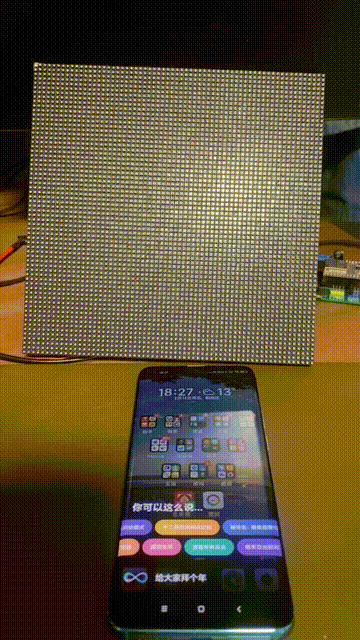

# 新年快乐

## 背景
大年初一在家里宅着没事儿干，刚好看到[点灯科技](https://diandeng.tech/)的这套物联网接入服务挺有意思，干脆就翻出上次做的那个[ESP32的Hub75E点阵屏驱动板](https://github.com/breakstring/esp32-hub75-adapter)来试试看和小米的小爱语音助手的整合。代码很简单，这里就不做多余的讲解了。

## 演示
